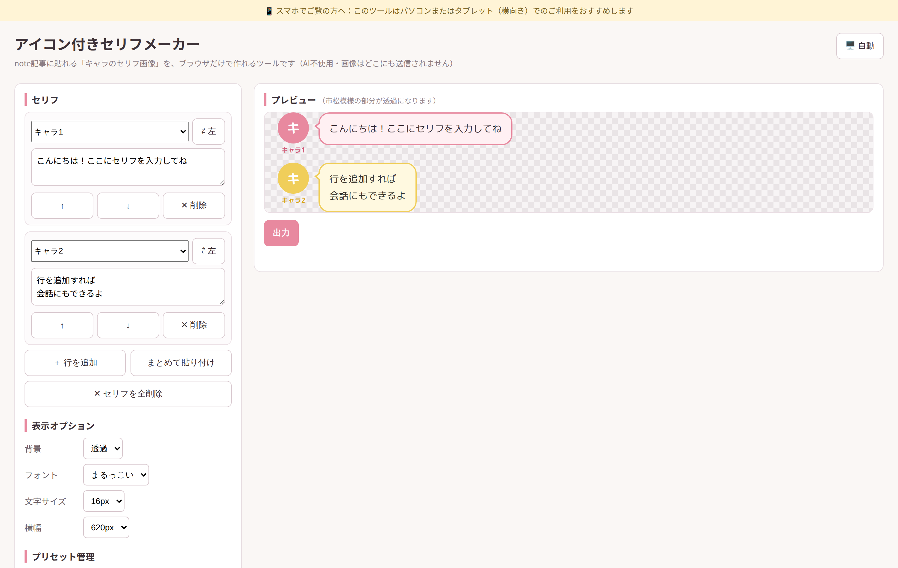
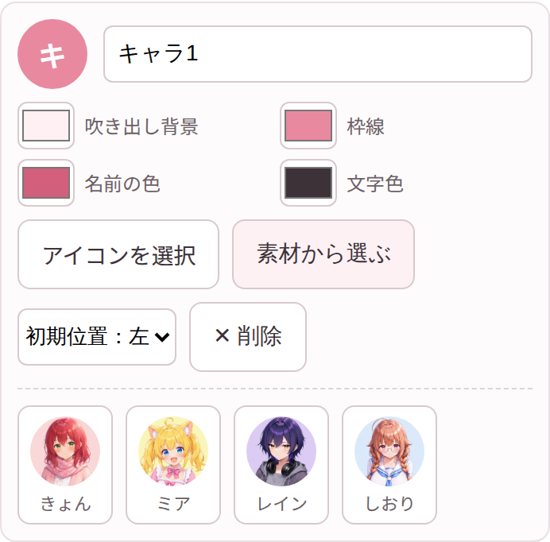
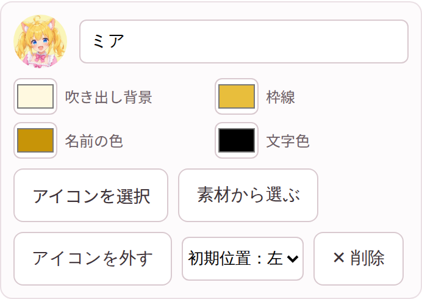
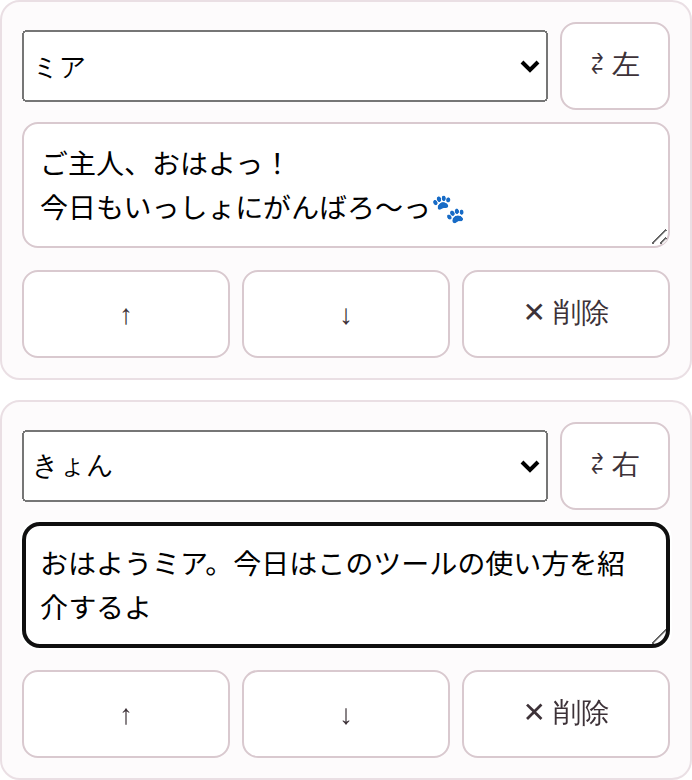
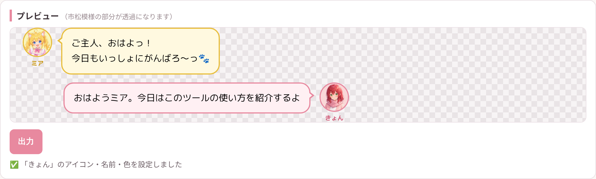
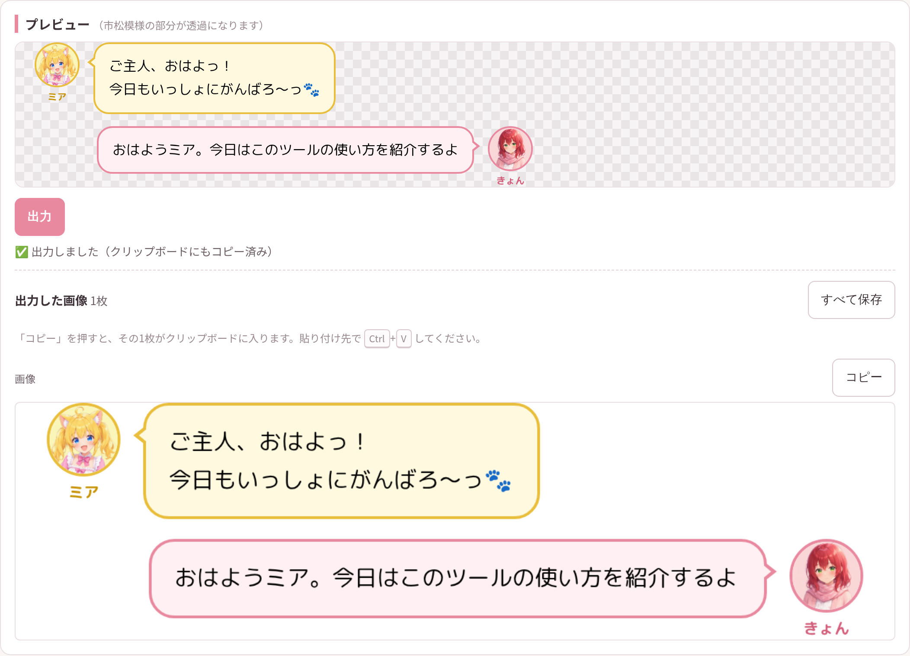
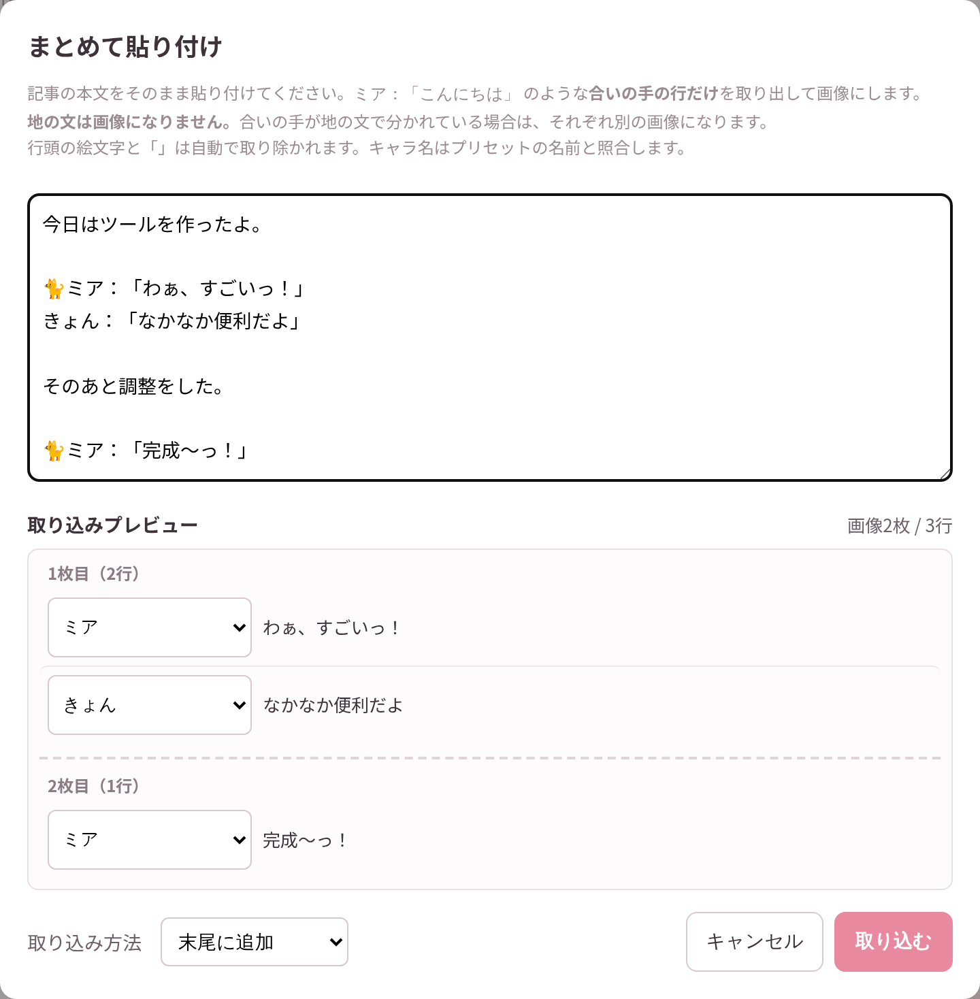
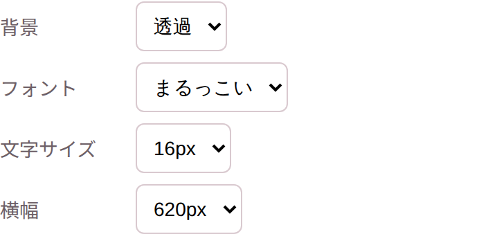

# アイコン付きセリフメーカー はじめてガイド

初めて使う人向けの、スクリーンショット付きかんたんガイドです。
「キャラのアイコン付きセリフ画像（LINE風の吹き出し）」を作って、note記事に貼るまでの流れを説明します。

> 💻 パソコンまたはタブレット（横向き）のブラウザ（Chrome推奨）で開いてください。スマホ向けには対応していません。

## 画面の見かた

ページを開くと、**左が編集パネル、右がプレビュー**の2列レイアウトです。
最初からサンプルのセリフが2行入っているので、いきなり触って試せます。

- **左パネル**（上から）: セリフ入力 → 表示オプション → プリセット管理
- **右パネル**: プレビューと「出力」ボタン。市松模様の部分は透過になります

## STEP 1. キャラを登録する（プリセット管理）

まず、左パネル下部の「プリセット管理」でキャラを設定します。
いちばん簡単なのは **「素材から選ぶ」** ボタン。同梱キャラ（きょん・ミア・レイン・しおり）のサムネイルが開きます。

好きなキャラをクリックすると、**アイコン・名前・吹き出しの色までまとめて自動設定**されます。

- 自分のキャラを使いたいときは **「アイコンを選択」** から画像をアップロードします（画像はどこにも送信されず、このブラウザの中だけで処理されます）
- 吹き出し背景・枠線・名前の色・文字色は、カードの色ボタンから自由に変えられます
- 「初期位置：左／右」で、そのキャラのアイコンをどちら側に出すか決められます

## STEP 2. セリフを入力する

左パネル上部の「セリフ」で、行ごとに **キャラを選んでセリフを入力** します。

- **⇄ ボタン** … アイコンと吹き出しの左右を切り替え（会話の相手を右側にすると会話っぽくなります）
- **＋ 行を追加** … 行を増やして会話にする
- **↑ ↓** … 行の並び替え、**✕ 削除** … 行の削除

入力するとプレビューに即反映されます。

## STEP 3. 出力して note に貼る

プレビューの下の **「出力」ボタン** を押すと画像ができます。

- 1枚だけのときは**自動でクリップボードにも入る**ので、noteでそのまま <kbd>Ctrl</kbd>+<kbd>V</kbd> するだけ
- 「コピー」ボタンで、好きな1枚をいつでもクリップボードに入れ直せます
- 複数枚のときは「すべて保存」→ 保存先フォルダを選ぶと日時つきフォルダにまとめて保存されます（⚠️ ダウンロードフォルダは選べないので、ドキュメントやデスクトップを選んでください）

## 便利機能：まとめて貼り付け

記事の台本ができているなら、「まとめて貼り付け」が速いです。
本文をそのまま貼ると、`ミア：「こんにちは」` のような **合いの手の行だけ** を自動で取り出してセリフ化します（地の文は画像になりません）。

## 見た目の調整（表示オプション）

| 項目 | 選べるもの |
| --- | --- |
| 背景 | 透過 ／ 白（noteのダークモードで文字が見えづらいときは白がおすすめ） |
| フォント | まるっこい ／ すっきり ／ 明朝 ／ 手書き風 |
| 文字サイズ | 14px ／ 16px ／ 18px |
| 横幅 | 620px ／ 700px ／ 800px |

## 知っておいてほしいこと

- 登録したプリセットは**このブラウザの中（localStorage）だけ**に保存されます。ブラウザのデータを削除すると消えます（同梱キャラは「素材から選ぶ」で戻せます）
- アップロードした画像は**どこにも送信されません**
- クリップボードには一度に1枚しか入りません（ブラウザの仕様）。複数枚は「すべて保存」→ フォルダごとドラッグ＆ドロップが便利です
- 右上のボタンでツール画面をライト／ダークに切り替えられますが、**出力される画像の見た目は変わりません**
